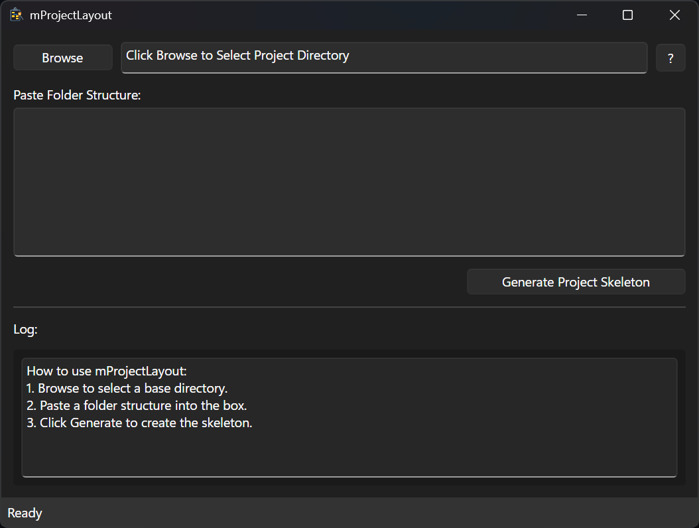

# mProjectLayout

A compact, expressive project scaffolding tool built with Avalonia and FluentAvalonia.  
mProjectLayout helps you generate clean, intentional project structures with a focus on clarity, modularity, and future‑proof organization.

## Screenshot



## Features

- Clean, minimal UI built with Avalonia + FluentAvalonia  
- Generates consistent, intentional project folder layouts  
- Built‑in presets for common project types  
- Automatic README and metadata scaffolding  
- Lightweight, fast, and fully self‑contained  
- Designed for clarity, repeatability, and expressive workflowcls

## Download

Grab the latest release from the Releases page:

**➡️ v1.0.1 – Icon Workflow Polish**

The Windows build is a **single‑file, self‑contained EXE** — no .NET runtime required.

## Quick Start

1. Launch `mProjectLayout.exe`  
2. Choose a preset or define your own layout  
3. Select a target directory  
4. Generate your project structure instantly  
5. Start building with a clean, intentional foundation

## Philosophy

mProjectLayout is built around a simple idea:

> *A project’s structure is the first chapter of its story.*

This tool helps you start every project with clarity, consistency, and expressive intent — no clutter, no guesswork, no boilerplate drift.

## Development

mProjectLayout is built with:

- **.NET 10**
- **Avalonia UI**
- **FluentAvalonia**
- **MVVM architecture**

To build locally:

```
dotnet build
```

To publish a self‑contained Windows build:

```
dotnet publish -c Release -r win-x64 --self-contained true /p:PublishSingleFile=true
```

## Roadmap

- Additional layout presets  
- Custom preset editor  
- Export/import preset definitions  
- macOS & Linux builds  
- Optional CLI mode  

## License

TBD — will be added in a future release.

---


