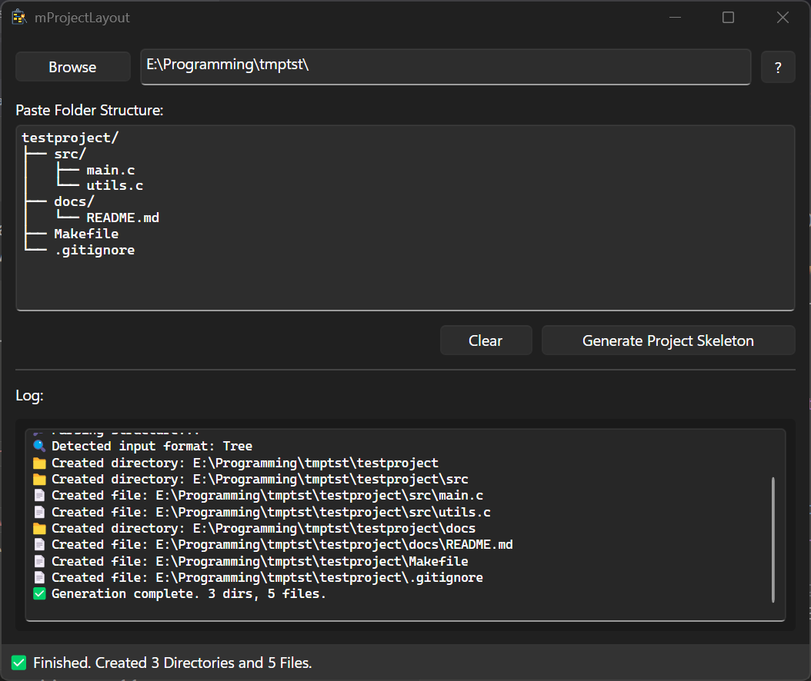

# mProjectLayout


A compact, expressive project scaffolding tool built with Avalonia and FluentAvalonia.
mProjectLayout helps you generate clean, intentional project structures with a focus on clarity, modularity, and future‑proof organization.

## Screenshot



## Features

- Clean, minimal UI built with Avalonia + FluentAvalonia
- Auto-detects input format — paste from any source, no reformatting needed
- Supports tree, path, and indented input styles (see [Input Formats](#input-formats))
- Handles extensionless files (`Makefile`, `Dockerfile`, `LICENSE`, `.gitignore`, etc.)
- Skips existing files and directories safely — never overwrites
- Detailed generation log with per-entry feedback
- Lightweight, fast, and fully self‑contained — no .NET runtime required

## Download

Grab the latest release from the [Releases page](https://github.com/smokeluce/mProjectLayout/releases):

**➡️ v1.0.1 – Icon Workflow Polish**

The Windows build is a **single‑file, self‑contained EXE** — no .NET runtime required.

## Quick Start

1. Launch `mProjectLayout.exe`
2. Select a target base directory using **Browse**
3. Paste a project structure into the input box (any supported format)
4. Click **Generate**
5. Start building with a clean, intentional foundation

## Input Formats

mProjectLayout auto-detects which format you're using on every generation — no configuration needed. Paste from an AI, a text file, or type it yourself.

---

### Format 1 — Tree (box-drawing characters)

The standard output of the `tree` command and the format most AI tools (ChatGPT, Copilot, Claude, etc.) produce naturally. This is the primary intended workflow.

```
project/
├── src/
│   ├── main.c
│   └── utils.c
├── docs/
│   └── README.md
├── Makefile
└── .gitignore
```

**Tip:** Ask any AI assistant: *"Give me a project layout for a C console app"* and paste the result directly.

---

### Format 2 — Explicit paths

Full or partial paths using backslash or forward slash separators. Useful when you already have a path list or are migrating an existing structure.

```
myproject
myproject\src
myproject\src\main.c
myproject\src\utils.c
myproject\docs
myproject\docs\README.md
myproject\Makefile
myproject\.gitignore
```

Forward slashes work too:

```
myproject/src/main.c
myproject/docs/README.md
```

---

### Format 3 — Indented (spaces only)

Plain indented text with no box-drawing characters. The indent unit is auto-detected from the first indented line — 2-space, 4-space, and tab-equivalent indents all work.

```
project/
    src/
        main.c
        utils.c
    docs/
        README.md
    Makefile
    .gitignore
```

---

### File vs. Directory Detection

mProjectLayout determines whether an entry is a file or directory using these rules, in order:

| Rule | Example | Result |
|------|---------|--------|
| Trailing `/` or `\` | `src/` | Directory |
| Known extensionless filename | `Makefile`, `Dockerfile`, `LICENSE`, `.gitignore` | File |
| Dotfile with no extension | `.env`, `.editorconfig` | File |
| Has a file extension | `main.c`, `app.config` | File |
| No extension, no trailing slash | `src`, `docs` | Directory |

---

## AI Workflow

mProjectLayout is designed to work hand-in-hand with AI assistants:

1. Ask your AI of choice for a project layout:
   > *"Suggest a folder structure for a Python FastAPI project"*
2. Copy the response
3. Paste it into mProjectLayout
4. Select your base directory
5. Click **Generate** — done

The tree format that AI tools produce is parsed directly with no cleanup required.

---

## Philosophy

mProjectLayout is built around a simple idea:

> *A project's structure is the first chapter of its story.*

This tool helps you start every project with clarity, consistency, and expressive intent — no clutter, no guesswork, no boilerplate drift.

---

## Development

mProjectLayout is built with:

- **.NET 10**
- **Avalonia UI**
- **FluentAvalonia**
- **CommunityToolkit.Mvvm**
- **MVVM architecture**

To build locally:

```
dotnet build
```

To publish a self‑contained Windows build:

```
dotnet publish -c Release -r win-x64 --self-contained true /p:PublishSingleFile=true
```

---

## Roadmap

- Additional layout presets
- Custom preset editor
- Export/import preset definitions
- macOS & Linux builds
- Optional CLI mode

---

## License

MIT License — see [LICENSE](LICENSE) for details.

Copyright © 2026 Paul Swonger (smokeluce)
